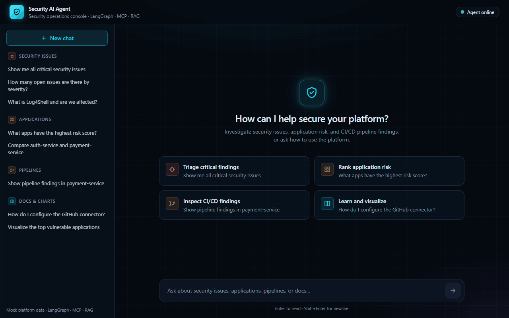
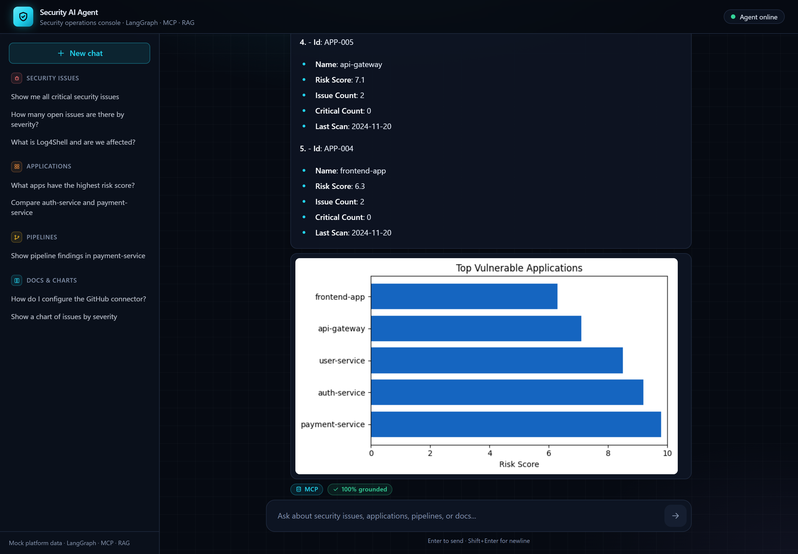
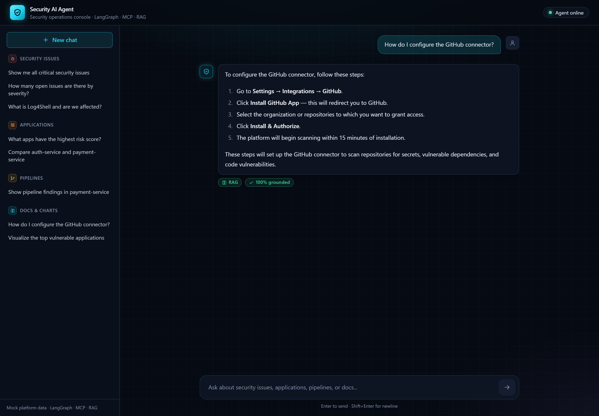
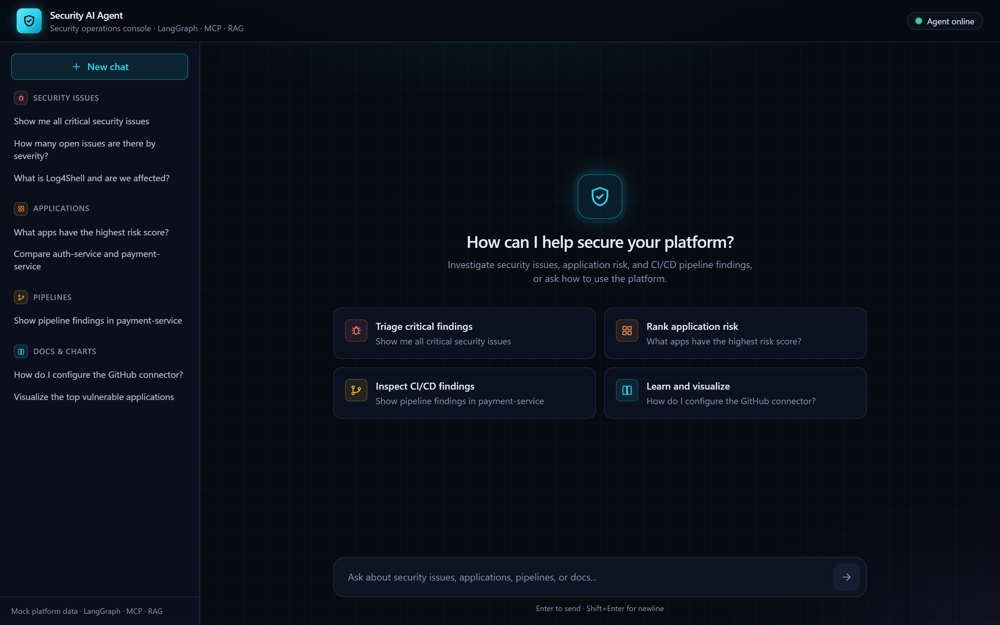
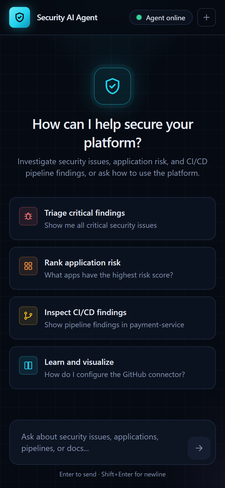

# Security Platform AI Agent

An AI security assistant built with **LangGraph**. Ask it about vulnerabilities, application risk,
or CI/CD pipeline findings and it pulls live data from a mock security platform over **MCP**; ask
it how to use the platform and it answers from the documentation with **RAG** and source
citations. A FastAPI backend streams answers to a React chat UI.

Everything runs locally with mock data. The only external dependency is an OpenAI API key.



---

## Screenshots

| Live data + charts (MCP) | Documentation answers (RAG) |
|---|---|
|  |  |

<details>
<summary>Home screen and mobile view</summary>




</details>

---

## Architecture

```
User query  (React UI -> FastAPI /chat/stream, or CLI)
    |
classify_query  -- InputGuardrail blocks prompt-injection attempts before any LLM call -> END
    |
    |-- data      -> mcp_node                -> format_response -> validate_response
    |-- doc       -> rag_node                -> format_response -> validate_response
    |-- mixed     -> mcp_node + rag_node     -> format_response -> validate_response
    |-- synthesis -> synthesis_node          -> validate_response
    `-- chart     -> chart_node              -> END

mcp_node           -- LLM picks MCP tools and filters; calls the FastMCP mock server
rag_node           -- multi-query search over ChromaDB (docs/*.md)
synthesis_node     -- answers from conversation history, no tool call
chart_node         -- charts the previous turn's data
format_response    -- deterministic markdown for plain data / group-by counts, LLM otherwise
validate_response  -- LLM-as-judge groundedness score; warning appended below 0.7
```

Conversation state is kept per session with LangGraph's `MemorySaver`, so follow-ups like
"compare both" or "what service is it in?" resolve against earlier turns.

---

## Key Features

- **Query routing** — an LLM classifier picks data / doc / mixed / synthesis / chart and rewrites
  context-dependent follow-ups into standalone queries
- **MCP tools** — the LLM selects tools and filters; multiple tool calls run concurrently
- **RAG with citations** — markdown split by headers with parent-header breadcrumbs, multi-query
  retrieval (original query plus 3 LLM rephrasings), cosine-distance filtering of off-topic
  chunks, and a deterministic `Sources:` footer
- **Hallucination controls** — "no information" answer when nothing relevant is retrieved,
  deterministic rendering of tool results, and a groundedness check on every final answer
- **Prompt injection defense** — pattern-based input guardrail, XML-delimited untrusted data in
  prompts, and closing-tag sanitization of tool/doc output
- **Charts** — severity distribution and top vulnerable applications, rendered with Matplotlib
  and shown inline in the UI
- **Streaming UI** — dark security-console chat with Server-Sent Events, per-stage status
  updates, query-type and confidence badges, a live agent health indicator, and grouped
  example questions
- **Observability** — optional LangSmith tracing via environment variables

---

## Tech Stack

| Layer | Technology |
|-------|-----------|
| Agent | LangGraph, LangChain |
| LLM / embeddings | OpenAI `gpt-4o`, `text-embedding-3-small` |
| Vector store | ChromaDB (local) |
| Mock platform | FastMCP (`mcp` Python SDK, streamable HTTP) |
| API | FastAPI with SSE |
| Frontend | React, TypeScript, Vite, Tailwind CSS |
| Tooling | pytest, vitest, ruff |

---

## MCP Tools

| Tool | Filters |
|------|---------|
| `get_security_issues` | id, severity, category, status, application, keyword, cve_id, discovered_after, discovered_before, limit |
| `get_applications` | min_risk_score, limit (sorted by risk score, highest first) |
| `get_pipeline_issues` | id, severity, pipeline, stage, tool, branch (prefix match), keyword, detected_after, detected_before, limit |

---

## Quickstart

### Docker (one command)

Requires Docker with Compose.

```bash
cp .env.example .env               # then set OPENAI_API_KEY
docker compose up --build
```

Open http://localhost:5173. Compose starts the mock server, then the API once the mock server is
healthy, then the UI once the API is healthy. The RAG index is kept in a Docker volume, so it is
only built on the first start. Stop with `Ctrl+C`, or `docker compose down` (add `-v` to also
delete the index).

### Local

Requires Python 3.12+ and Node.js.

```bash
python -m venv .venv
source .venv/bin/activate          # Windows: .venv\Scripts\activate
pip install -r requirements.txt
cp .env.example .env               # then set OPENAI_API_KEY
```

Run each service in its own terminal:

```bash
uvicorn mock_server.main:app --port 8000     # mock security platform (MCP at /mcp)
uvicorn api.main:app --port 8001             # agent API; builds the RAG index on first start
cd frontend && npm install && npm run dev    # UI at http://localhost:5173
```

Or skip the UI and chat in the terminal with `python main.py` (the mock server must be running).

Optional settings in `.env`: `OPENAI_MODEL` (default `gpt-4o`), `RAG_TOP_K` (default `5`),
`RAG_DISTANCE_THRESHOLD` (default `0.5`), and `LANGCHAIN_TRACING_V2` / `LANGCHAIN_API_KEY` /
`LANGCHAIN_PROJECT` for LangSmith.

---

## Example Queries

```
Show me all critical issues
Top 3 most vulnerable applications
Show me Semgrep findings from the auth pipeline
How many issues are there by severity?
Tell me about PIPE-006
How do I connect Jira to the platform?
Are there any Jira connector issues?
Visualize the top vulnerable applications

> Show me issues in auth-service
> Now show me payment-service issues
> Compare both
```

---

## Project Structure

```
agent/          graph, nodes, state, prompts, guardrails, charts
api/            FastAPI app: /chat, /chat/stream (SSE), /health
mcp_client/     MCP client and LangChain tool wrappers
mock_server/    FastMCP server, Pydantic models, mock data
rag/            ChromaDB indexer and retrievers
docs/           markdown knowledge base used by RAG
assets/         README screenshots and demo GIF
frontend/       React chat UI
tests/          pytest suite
main.py         CLI chat loop
docker-compose.yml   runs the mock server, API, and UI together
```

---

## Tests

```bash
pytest                              # 184 Python tests
cd frontend && npx vitest run       # 46 frontend tests
ruff format --check . && ruff check .
```

---

## License

[MIT](LICENSE)
